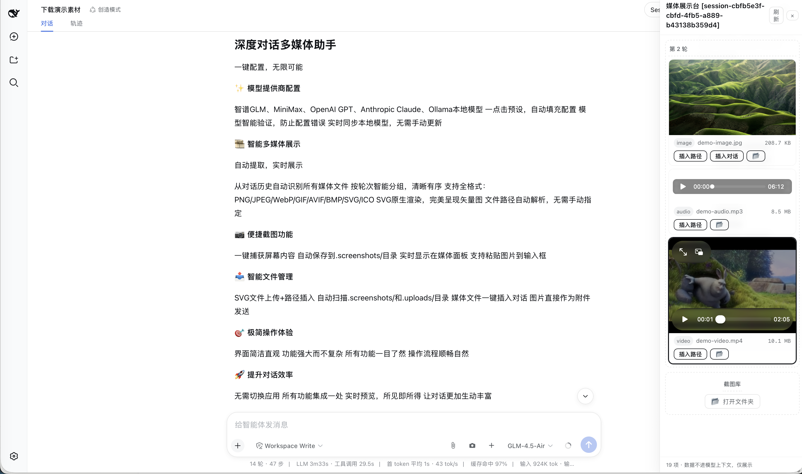

# Provider Quick Config — a dsh dynamic plugin

[中文版](./README.zh.md) | English

> **Plugin source lives in this repo**: `plugin/` holds the dynamic-plugin form (`host.js` = Host half, `client.js` = Client half, `manifest.json` = restorable definition); **`dsh-provider-quick-config/` is the formally installable npm package** (Host via `dsh.bundle`, Web UI via `dsh.client`) — **zero changes to deepseek-harness source** (the repo's tracked files show no modifications; it is byte-identical to the cloud `origin/master`).

## Screenshot



## Two ways to use this plugin

| | Dynamic plugin (quick/dev) | **Formal install (recommended, permanent)** |
|---|---|---|
| Install | `cordis_define` in a session + approve the Run card | npm package installed into the `web` profile |
| Lifetime | current harness process only — **lost on restart** | **survives restarts**, permanent |
| Communication | `harness.handle` / `host.call` (sandbox RPC) | standard wire (`connection.api`: settings / credentials / llm) |
| Source | `plugin/` | `dsh-provider-quick-config/` |

### Formal install (already done on this machine)

The package was built, packed (`dsh-provider-quick-config-0.5.4.tgz`) and installed into the `web` profile:

```bash
cd /path/to/deepseek-harness
# pack the package (in dsh-provider-quick-config/): npm pack
node --import tsx/esm apps/cli/src/bin.ts plugin --profile web add \
  file:/path/to/dsh-provider-quick-config/dsh-provider-quick-config-0.5.4.tgz
cd ~/.dsh/profiles/web && pnpm install   # only needed when the tarball path changed
```

`dsh plugin add` runs `pnpm add` in the profile and appends the package to `dsh.profile.bundles` when it declares `dsh.bundle.patch`. Verify:

```bash
cat ~/.dsh/profiles/web/package.json
# dsh.profile.bundles should include "dsh-provider-quick-config"
```

**Then restart `dsh web`** (e.g. `deepseek.sh restart`) — the Host half mounts from the profile bundle, and `dsh-client-modules` serves the Web half at `/plugins/dsh-provider-quick-config/client.js`. After restart: the **+** button appears next to Send (no per-session approval needed anymore).

Update after code changes: bump the version, re-pack, `dsh plugin --profile web add file:…<new>.tgz` (or update the dependency spec + `pnpm install`), restart.
Uninstall: `dsh plugin --profile web remove dsh-provider-quick-config`, restart.

A **+** button next to the **Send** button in the DeepSeek Harness Web GUI. Click it to configure model providers without touching config files by hand:

- List every configured provider route (`llm-pi-ai.providers.*`) with credential status and the models each one serves.
- **One-click vendor presets**: 智谱 GLM, MiniMax, OpenAI GPT, Anthropic Claude, Local models (Ollama) — endpoint / protocol / thinkingFormat / model list are pre-filled.
- **Model picker**: per-vendor quick-model chips (click to select/deselect) plus free-form rows (id / ctx / max) — e.g. switch MiniMax to **M3** by clicking the `MiniMax-M3` chip, no JSON editing.
- **Auto-validate model names on save (ping)**: before saving, the plugin queries the endpoint's `GET /models` and compares (case/dash-insensitive). A model that does not exist (e.g. typing `glm4.6v` instead of `GLM-4.6`) fails with a red error and **blocks the save**. Endpoints that do not support listing are skipped and saved normally.
- **Auto-load local models**: picking the Ollama preset immediately fetches `GET /models` and fills the form (a "Fetch models" button exists on every custom route too).
- **Auto-sync local models (syncModels)**: routes marked `syncModels: true` (Ollama preset on by default, toggle in the form, badge in the list) are compared against their endpoint's `GET /models` **every 60s in the background**; when the endpoint list changes (e.g. you `ollama pull` a new model) the plugin writes the new list back to settings.yaml automatically and the dropdown follows — no manual editing. Endpoint order wins, capacities of already-configured models are preserved. Verified end-to-end.
- **Multiple API keys per vendor**: add the same vendor again and the route key auto-numbers (`glm` → `glm2` → `glm3`…), display name gets `· 号N`.
- **Media showcase (🎞)**: a persistent right-side panel that scans the current session's history and shows every media file the conversation mentioned — **images (PNG/JPEG/WebP/GIF/AVIF/BMP/SVG/ICO), videos, recordings**. SVG renders natively in ``. Files are resolved from the session's working directory, with a **filename search fallback** (a file whose text reference is missing a path prefix, e.g. `tiile-20260815/x.mp4` actually under `outputs/tiile-20260815/`, is still found). Items are **grouped by conversation turn** ("第 1 轮", "第 2 轮"…). Media data never enters the model context — display only. Each item can **insert its path** into the composer (`inputActions.setDraft`), and raster images can additionally be **inserted as an attachment**. The panel also auto-scans `<cwd>/.uploads/` (SVG/通用上传) and `<cwd>/.screenshots/` (截图库) so files written there appear automatically, grouped into separate "upload library" and "screenshot library" turns.
- **SVG upload + insert path**: the upload button accepts `.svg` (PNG/JPEG/WebP/GIF still go through as image attachments). SVG files are saved to `<session cwd>/.uploads/<name>` via the new `save-media` endpoint, and the path is appended to the composer as `` — visible inline once sent, and the SVG appears in the media showcase (it can also be dragged or pasted from the file system into `<cwd>/.uploads/` to land in the showcase).
- **Screenshot 📷**: captures the screen via `getDisplayMedia`, **saves the PNG into `<session cwd>/.screenshots/`** (the media-showcase library folder, gitignored) and writes the returned path into the composer — you decide whether to send it. The saved screenshot automatically appears in the showcase.


- Custom **OpenAI-compatible** providers (any gateway / self-hosted server) with hand-written `api`, `baseURL`, `thinkingFormat`, and model list.
- Edit / delete existing routes; set or update API keys.

## How it works (no harness code changes — pure config files, hot-reload)

The plugin does not invent its own config store; it drives the two seams the harness already ships:

| Action | Written to | Effect |
|---|---|---|
| Add / edit / delete routes | `llm-pi-ai.providers` in `$DSH_HOME/settings.yaml` | settings `mutate` → file persisted → the `llm-pi-ai` adapter's watcher re-registers — **live on the next request** |
| Save / update API keys | `$DSH_HOME/.credentials.yaml` (0600) | credentials `set` → file is watched, hot-reloads |

Only **credential references (environment-variable names)** are stored by the plugin; key values go straight into `.credentials.yaml` and never come back to the GUI.

Route writes go through `settings.mutate`, which validates against the `llm-pi-ai` namespace schema + `assertServiceable`: a wrong protocol, empty baseURL, or invalid model is **rejected at write time** — a broken route can never be stored.

## Install / run

1. Approve the Run card in this session (single check is enough; double check auto-runs future versions).
2. Refresh the page — the **+** appears in the composer's tool row, next to the model selector / send button.
3. Click **+** → Add Provider → pick a preset or custom → fill the form → Save.

> The official **Settings → Models** page still works alongside; this plugin is the quick entry point beside the input box.

## Restoring the plugin after a process restart

Dynamic plugins live only in process memory: **restarting `dsh web` removes `pprov-1`**. Restore from this repo (the source never goes away):

1. `code.host` ← full content of `plugin/host.js`
2. `code.client` ← full content of `plugin/client.js`
3. Re-define with `cordis_define` (`kind: "new"`, `idPrefix: "pprov"`; copy `name` / `purpose` from `plugin/manifest.json`), then `cordis_run`.

Your configuration (`~/.dsh/settings.yaml` + `.credentials.yaml`) is untouched, so routes reappear immediately.

## Form fields

| Field | Notes |
|---|---|
| Route key | Unique id (the `providers` dict key); arbitrary, **immutable after save**. Multiple keys per vendor (glm1 / glm2 …) |
| Display name | Shown in the model picker; defaults to the key |
| Credential ref | Environment-variable name, e.g. `GLM_API_KEY`; resolved per request through credentials |
| API key | Optional. Filled → written to `.credentials.yaml`; empty → keep existing / rely on env |
| API protocol | Custom routes pick one: `openai-completions` / `openai-responses` / `anthropic-messages` |
| BaseURL | Required for custom routes |
| thinkingFormat | Reasoning-field dialect for `openai-completions`: `openai / deepseek / openrouter / together / zai / qwen / string-thinking / ant-ling`. Hand-write when the endpoint URL is unrecognized (MiniMax → `deepseek`, Zhipu → `zai`) |
| Models | Custom routes need ≥1: `[{ "id": "…", "contextWindow": 131072, "maxTokens": 32768 }]` |

## Pitfalls (learned the hard way)

- **Ollama still wants a key**: the OpenAI-compatible implementation always sends an `Authorization` header, so give it any non-empty placeholder (e.g. `local`).
- **Catalog routes don't need a model list**: key + credential only; endpoint/protocol/models are inherited from the pi-ai catalog. Hand-written routes declare models explicitly.
- **`.credentials.yaml` is strict**: a flat `name: value` map; the root must be a mapping, values must be non-empty strings, and duplicate keys fail the whole file at startup.
- **⚠️ Do NOT use YAML anchors (`&anchor` / `*anchor`) in settings.yaml**: the settings service saves with node-preserving merges; once a save replaces the anchor's owner (e.g. `glm`'s `models: &glm_models`), remaining `*glm_models` aliases dangle and the whole document fails to serialize with `Unresolved alias (the anchor must be set before the alias)` — both this plugin and the official Settings → Models page hit it. Write shared model lists explicitly (or ask the plugin/me to flatten the file first).
- **Environment variables are a startup snapshot**: `export` after launch does nothing until restart; use this plugin's key field (writes `.credentials.yaml`) instead.
- **`apiKeyEnv` set but unresolvable** → `MISSING_CREDENTIAL`; it will not fall back to some other key that happens to be in the environment.
- **Safari screen-capture permission (📷 button does nothing / picker never opens)**: Safari's screen-share permission lives **inside Safari itself, not System Settings**. Fix: Safari → menu bar **Safari → Settings…** (⌘,) → **Websites** tab → **Screen Sharing** (or "Screen Recording") in the left list → find your host (`127.0.0.1:<port>` or the domain you use) → change it from **Deny** to **Ask** (or **Allow**) → **completely quit Safari (⌘Q) and reopen** (a plain refresh is not enough — [WebKit bug 253024](https://wiki.webkit.org/show_bug.cgi?id=253024) keeps the failure sticky across reloads). Also confirm System Settings → Privacy & Security → Screen Recording has Safari checked. **If you once clicked "Don't Allow" and it never asks again**: that decision is remembered per-site — go back to **Safari → Settings → Websites → Screen Sharing**, find the site, and **delete the row entirely** (remove, don't just switch the state), or set it to **Ask**; then quit Safari (⌘Q) and reopen — the picker prompt comes back. If it still fails, use the system screenshot instead: `⌘⇧4` then paste (`⌘V`) into the input box (the composer natively accepts pasted images).
- Sessions that already sent requests keep the model recorded in their log; if the default model points to a deleted provider, the picker asks you to choose again.

## Technical notes (for plugin maintainers)

- **Host half** (`harness.handle` RPC, all through `ctx.settings` / `ctx.credentials` / `ctx.llm`):
  - `providers.list` → configured routes + credential state + pi-ai directory + protocol/dialect enums
  - `providers.save` / `providers.remove` → **ops are built Client-side and arrive over the wire**; the Host only forwards them to `settings.mutate('llm-pi-ai', ops, revision)`
  - `providers.discover` → `ctx.llm.discoverModels('llm-pi-ai', { baseURL, api, apiKey })`
  - `providers.ping` → same discovery, then validates each model id (normalized) against the listing
  - `credentials.set` / `credentials.unset`
- **⚠️ vm-sandbox realm trap**: dynamic Host code runs in a `node:vm` realm, so any object literal is not a host-realm plain object — passing one to a service that checks `isPlainObject` (like `settings.mutate` / `settings.update`) throws `ops must be {op:'set'|'unset', path}`. **Any structured data for such services must be constructed Client-side and passed through the `host.call` JSON wire** (wire-decoded values are host-realm); the Host only forwards. Return values are fine — the guard re-materializes them.
- **Client half**: the `+` button registers in `conversation.input.right` (tool row before the send button); the panel registers in `conversation.input.overlay` (the composer's floating anchor); all colors use `--dsw-*` theme variables.
- Writes carry `expectedRevision`; a concurrent edit raises `SETTINGS_CONFLICT` and the client re-reads and retries once.

## Repository layout

```
DeepSeek-Harness-provider/
├── README.md          # this file (English)
├── README.zh.md       # 中文版
├── plugin/
│   ├── host.js        # Host half source (code.host body)
│   ├── client.js      # Client half source (code.client body)
│   └── manifest.json  # restorable definition (name/purpose/code)
└── .gitignore
```
