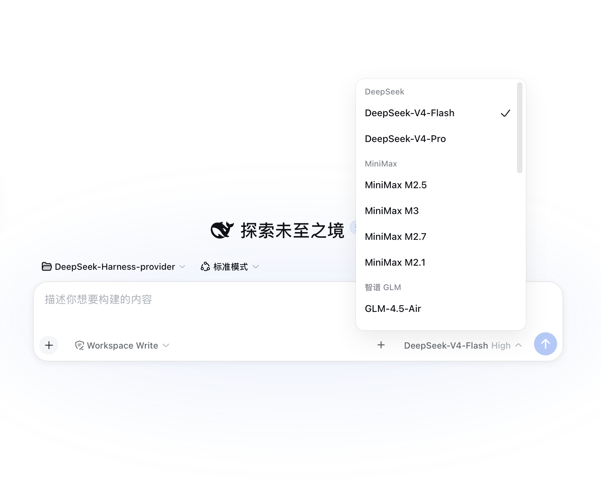

# Provider Quick Config（dsh 动态插件）

[English](./README.md) | 中文

> **插件源码都在本目录**：`plugin/` 是动态插件形态（`host.js` = Host 半、`client.js` = Client 半、`manifest.json` = 可恢复定义）；**`dsh-provider-quick-config/` 是正式可安装的 npm 包**（Host 走 `dsh.bundle`，Web UI 走 `dsh.client`）——**不修改 deepseek-harness 任何源码**（仓库已跟踪文件 0 改动，本地与云端 `origin/master` 逐字节一致）。

## 截图



## 两种使用方式

| | 动态插件（开发/临时） | **正式安装（推荐，长期）** |
|---|---|---|
| 安装 | 会话里 `cordis_define` + 批准 Run 卡 | npm 包装进 `web` profile |
| 生命周期 | 只在当前 harness 进程，**重启即失** | **重启不丢，永久生效** |
| 通信 | `harness.handle` / `host.call`（沙箱 RPC） | 标准 wire（`connection.api`：settings / credentials / llm） |
| 源码 | `plugin/` | `dsh-provider-quick-config/` |

### 正式安装（本机已装好）

已打包成 `dsh-provider-quick-config-0.4.0.tgz` 并装进 `web` profile：

```bash
cd /path/to/deepseek-harness
# 打包（在 dsh-provider-quick-config/ 里执行）：npm pack
node --import tsx/esm apps/cli/src/bin.ts plugin --profile web add \
  file:/path/to/dsh-provider-quick-config/dsh-provider-quick-config-0.4.0.tgz
cd ~/.dsh/profiles/web && pnpm install   # 仅当 tarball 路径变化时需要
```

`dsh plugin add` 会在 profile 里跑 `pnpm add`，包声明了 `dsh.bundle.patch` 就会自动加进 `dsh.profile.bundles`。验证：

```bash
cat ~/.dsh/profiles/web/package.json
# dsh.profile.bundles 应包含 "dsh-provider-quick-config"
```

**然后重启 `dsh web`**（如 `deepseek.sh restart`）——Host 半随 profile bundle 挂载，`dsh-client-modules` 在 `/plugins/dsh-provider-quick-config/client.js` 提供 Web 半。重启后发送键旁出现 **+**（不再需要每次会话批准）。

改代码后更新：升版本 → 重新 `npm pack` → `dsh plugin --profile web add file:…<新版本>.tgz`（或改依赖指向 + `pnpm install`）→ 重启。
卸载：`dsh plugin --profile web remove dsh-provider-quick-config`，重启。

在 DeepSeek Harness Web GUI 的**发送键旁边**加一个 **+** 号按钮。点开后弹出面板，可以：

- 列出当前已配置的模型 Provider（`llm-pi-ai.providers.*` 路由），显示凭据是否已配置、每个 Provider 挂着哪些模型；
- **预设厂商一键添加**：智谱 GLM、MiniMax、OpenAI GPT、Anthropic Claude、本地模型 (Ollama) —— 端点 / 协议 / thinkingFormat / 模型列表都预填好；
- **模型选择器**：编辑表单里每个厂商有"快捷模型"chips（点一下选中/取消），也能手动加任意模型 id 并填 ctx/max —— 比如 MiniMax 想用 M3，点 `MiniMax-M3` chip 即可，不需要碰 JSON；
- **保存前自动校验模型名（ping）**：点保存时插件先请求端点的 `GET /models` 对照模型列表（大小写/连字符忽略）——不存在的模型名直接红字报错并**阻止保存**（如把 `GLM-4.6` 打成 `glm4.6v` 会被当场指出）；端点不支持列表查询或没开则跳过校验正常保存；
- **本地模型自动加载**：选 Ollama 预设后自动请求 `GET /models` 把本机模型列表填进表单（也可在任何自定义路由上点"自动获取模型"）；
- **本地模型自动同步（syncModels）**：路由打上 `syncModels: true`（ollama 预设默认开、表单可勾选、列表有"自动同步"徽标）后，插件**后台每 60 秒**对比端点 `GET /models` 与当前配置——端点模型变了（比如 `ollama pull` 新模型）就**自动写回 settings.yaml**，下拉框自动跟上，不用手动补。端点顺序为准，已配置模型的 ctx/max 保留。已端到端验证（删掉 gemma4 后一个周期内自动加回）。
- **同一厂商加多个 key**：再点同一个厂商，key 自动排号（glm → glm2 → glm3…），显示名自动带"号N"；
- **媒体展示台（🎞）**：会话标题栏的 🎞 按钮打开右侧常驻面板，自动扫描当前会话历史，把对话里提到的**图片 / 视频 / 录音**全部展示出来（支持相对工作目录路径，**找不到时按文件名递归搜索兜底**——比如文本写 `tiile-20260815/x.mp4` 但实际在 `outputs/tiile-20260815/` 下，也能找到）。条目**按对话轮次分组**（第 1 轮、第 2 轮…）。媒体数据**不进模型上下文**，纯展示。每个条目可"插入路径"写进输入框，图片额外可"插入对话"（附件）。
- **截图 📷**：`getDisplayMedia` 截屏后**默认保存到 `<会话工作目录>/.screenshots/`**（即展示台多媒体库目录，已 gitignore），并把返回路径写进输入框——由你决定是否发送。保存后自动出现在展示台里。
- 或添加**自定义 OpenAI 兼容** Provider（自建网关 / 本地服务，手写 `api`、`baseURL`、`thinkingFormat`、模型列表）；
- 编辑 / 删除已有路由；填写或更新 API 密钥。

## 原理（零代码改动，纯配置文件热生效）

它没有自己另建一套配置，而是直接调用 harness 已有的两个 seam：

| 动作 | 写入位置 | 生效方式 |
|---|---|---|
| 添加 / 编辑 / 删除路由 | `$DSH_HOME/settings.yaml` 的 `llm-pi-ai.providers` | settings 服务 `mutate` → 文件落盘 → `llm-pi-ai` 适配器 watcher 重注册，**下一次请求即生效** |
| 保存 / 更新 API 密钥 | `$DSH_HOME/.credentials.yaml`（0600） | credentials 服务 `set` → 文件被监听，热生效 |

插件只存**凭据引用（环境变量名）**，密钥值只进 `.credentials.yaml`，不回传 GUI。

写路由时走 `settings.mutate`，它会经过 `llm-pi-ai` 命名空间的 schema + `assertServiceable` 校验：配错的协议、空 baseURL、非法模型会被**在写入时就拒绝**并报错，不会把坏路由存进去。

## 安装 / 运行

1. 在本会话的 Run 卡片上允许授权（单勾即可，双勾允许后续版本自动运行）；
2. 刷新页面后，聊天输入框右侧（发送键旁）会出现 **+**；
3. 点 **+** → 添加 Provider → 选模板或自定义 → 填表单 → 保存。

> 也可同时打开 **设置 → 模型** 使用官方的完整模型页；本插件是输入框旁的快捷入口。

## 进程重启后如何恢复插件

动态插件只活在进程内存里，**重启 dsh web 后 pprov-1 会消失**。恢复方法（源码都在本目录，不会丢）：

1. `code.host` ← `plugin/host.js` 全文；
2. `code.client` ← `plugin/client.js` 全文；
3. 用 `cordis_define`（`kind: "new"`，`idPrefix: "pprov"`，`name` / `purpose` 照抄 `plugin/manifest.json`）重新定义，再 `cordis_run`。

配置本身（`~/.dsh/settings.yaml` + `.credentials.yaml`）不受影响，恢复后路由立刻还在。

## 表单字段说明

| 字段 | 说明 |
|---|---|
| 路由 key | 唯一标识（`providers` 字典的 key），可随意起名，**保存后不可改**。同一厂商可建多条（如 glm1 / glm2） |
| 显示名 | 模型选择器里显示的名字，默认用 key |
| 凭据引用 | 环境变量名，如 `GLM_API_KEY`；请求时经 credentials 解析 |
| API 密钥 | 选填。填了 → 写入 `.credentials.yaml`；留空 → 不改动 / 靠环境变量 |
| API 协议 | 自定义路线三选一：`openai-completions` / `openai-responses` / `anthropic-messages` |
| BaseURL | 自定义路线必填 |
| thinkingFormat | `openai-completions` 的推理字段方言：`openai / deepseek / openrouter / together / zai / qwen / string-thinking / ant-ling`。自建端点猜不到就手写（如 MiniMax → `deepseek`，智谱 → `zai`） |
| 模型列表 | 自定义路线至少一项：`[{ "id": "…", "contextWindow": 131072, "maxTokens": 32768 }]` |

## 踩坑备忘（来自实际使用记录）

- **Ollama 也要填密钥**：OpenAI 兼容实现照样发 `Authorization` 头，占位非空即可（如 `local`）。
- **目录路线不用写模型**：只要 key + 密钥，模型/端点/协议继承 pi-ai 目录；自定义路线才手写模型。
- **`.credentials.yaml` 格式极严**：平铺 `名字: 值`，根必须是映射、值必须非空字符串、不能重复 key，任何一条都会启动失败。
- **⚠️ settings.yaml 不要用 YAML 锚点（`&anchor` / `*anchor`）**：settings 服务保存时按节点保留式合并，一旦保存替换了锚点定义者（如 `glm` 的 `models: &glm_models`），其余引用 `*glm_models` 的节点会变成悬空别名，整个文档序列化报 `Unresolved alias (the anchor must be set before the alias)`——插件和官方"设置→模型"页都会失败。多账号共用模型请写成显式列表（或让插件帮你展平）。已用锚点的文件可先展平再在 GUI 里保存。
- **环境变量是启动时快照**：进程启动后再 `export` 不生效，得重启；用本插件的密钥字段（写 `.credentials.yaml`）则不需要。
- **`apiKeyEnv` 配了但解析不到** → 直接 `MISSING_CREDENTIAL`，不会回退到环境里别的 key。
- **Safari 屏幕捕获权限（📷 按钮没反应 / 选屏窗口弹不出来）**：Safari 的屏幕共享权限**在 Safari 自己内部，不在系统设置里**。解决：Safari → 菜单栏「Safari 浏览器」→「设置…」（⌘,）→ 顶部「**网站**」标签 → 左侧列表找「**屏幕共享**」（或"屏幕录制"）→ 右侧找到你的站点（`127.0.0.1:<端口>` 或你用的域名）→ 从"拒绝"改成「**询问**」（或"允许"）→ **Cmd+Q 完全退出 Safari 再打开**（光刷新不行——[WebKit bug 253024](https://wiki.webkit.org/show_bug.cgi?id=253024) 会跨刷新持续失败）。同时确认系统设置 → 隐私与安全性 → 屏幕录制 里勾选了 Safari。仍不行就用系统截图：`⌘⇧4` 截图后回输入框 `⌘V` 粘贴（输入框原生支持粘贴图片）。
- 已发过请求的会话会保留日志里记录的模型；默认模型指向已删除的 Provider 时，选择器会要求重新选模型。

## 技术说明（给改插件的人）

- **Host 半**（`harness.handle` RPC，全部走 `ctx.settings` / `ctx.credentials` / `ctx.llm`）：
  - `providers.list` → 已配置路由 + 凭据状态 + pi-ai 目录 + 协议/推理方言枚举
  - `providers.save` / `providers.remove` → **ops 由 Client 构造、经 wire 传入**，Host 只转发给 `settings.mutate('llm-pi-ai', ops, revision)`
  - `providers.discover` → `ctx.llm.discoverModels('llm-pi-ai', { baseURL, api, apiKey })`
  - `providers.ping` → 同 discovery，再把每个模型 id（归一化后）对照端点模型列表
  - `credentials.set` / `credentials.unset`
- **⚠️ vm 沙箱 realm 陷阱**：动态 Host 代码跑在 `node:vm` 独立 realm 里，任何对象字面量都不是宿主 realm 的 plain object —— 传给校验 `isPlainObject` 的服务（如 `settings.mutate` / `settings.update`）会直接抛 `ops must be {op:'set'|'unset', path}`。**凡是传给这类服务的结构化数据，必须由 Client 侧构造、经 `host.call` 的 JSON wire 传入**（wire 解码后就是宿主 realm 对象）；Host 侧只做转发。返回结果则无所谓（guard 会自动把结果物化为宿主对象）。
- **Client 半**：`+` 按钮注册在 `conversation.input.right`（发送键左侧工具行），面板注册在 `conversation.input.overlay`（输入卡悬浮锚点），主题色全部走 `--dsw-*` 变量。
- 写操作带 `expectedRevision`，撞并发会 `SETTINGS_CONFLICT`，客户端自动重读重试一次。

## 仓库结构

```
DeepSeek-Harness-provider/
├── README.md          # 英文版
├── README.zh.md       # 本文件（中文版）
├── plugin/
│   ├── host.js        # Host 半源码（code.host 函数体）
│   ├── client.js      # Client 半源码（code.client 函数体）
│   └── manifest.json  # 可恢复定义（name/purpose/code）
└── .gitignore
```
